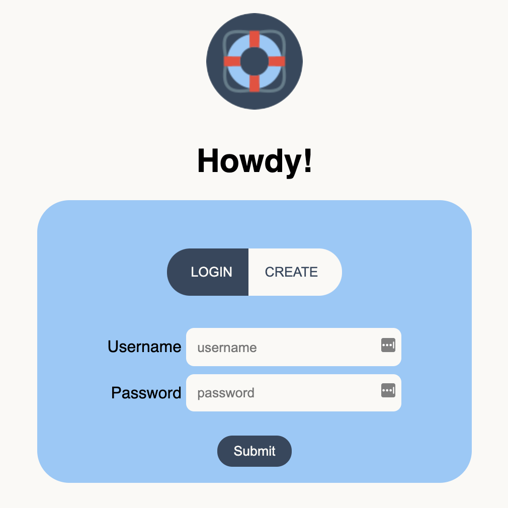
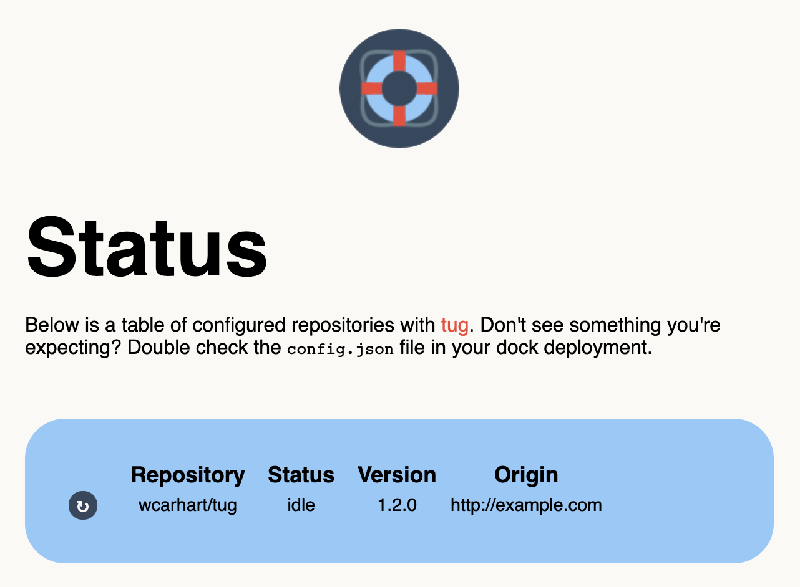

<p align="center"></p>

<h1 align="center">dock</h1>
<h5 align="center">a good place to keep some tugboats</h5>

## Overview
Dock is a wrapper, manager, and secure web interface for [tug](https://github.com/wcarhart/tug).

## Usage
Once dock is installed and running, simply navigate to the deployment's domain or IP address to access the login page. You can log into an existing account or create a new account using the deployment's special password (called `token` in the UI). To set up the special password, see [authentication & authorization](authentication--authorization).

<p align="center"></p>

Once you're authenticated, you'll be able to see all of your registered tugs based on your deployed [config.json](config.json) file.

<p align="center"></p>

Use the ↻ button to manually redeploy a tug, and click on any data in the table to copy it to the keyboard. Use the `Logout` button in the top right corner to end your session.

## Configuration
Dock operates from a [config.json](config.json) file, which configures its known tugs. Contrary to [tug](https://github.com/wcarhart/tug), dock's configuration file is quite simple - it's just a list of simple objects.

Here is an example of a dock `config.json` file.
```
{
  "tugs": [{
    "node": "tug-0",
    "origin": "http://example.com:42369"
  }]
}
```
The configuration schema only needs one field, `tugs`, which is a list of objects. Each of these objects must have two fields, `node`, which is the arbitrary, user-provided name for the tug node, and `origin`, which is a combination of scheme, domain, IP address, and port for where to reach the tug node (if you make a `GET /` request to `origin`, you should be able to access tug there). There can be as many nodes in the configuration file as desired. _Note that you do not need to specify what repositories are on which tug nodes - dock will configure that for you, even if there are multiple copies of the same repositories._

For clarify, here's a larger `config.json` file example.
```
{
  "tugs": [
    {
      "node": "tug-0",
      "origin": "http://123.123.123.123:42369"
    },
    {
      "node": "tug-1",
      "origin": "http://255.255.255.255:42369"
    }
  ]
}
```

## Install
To get a local install started, first clone this repository.
```bash
git clone git@github.com:wcarhart/dock.git
```
Once the code is downloaded, you'll need a few things before you can start the server. First, you'll need an `.env` file to keep application secrets. For that, see [loading environment secrets](#loading-environment-secrets). Second, you'll need a MongoDB instance to manage accounts. For that, see [authentication and authorization](#authentication--authorization).

Once you're ready to continue, go ahead and install dependencies and run the application. Install dependencies with [Yarn](https://yarnpkg.com/).
```bash
cd dock
yarn install
```
Use the Yarn scripts `dev` or `host` to start a local server.
```bash
yarn dev  # starts local development server on `localhost`
yarn host # local development server on the local network
```
**Dock runs on port 12147 by default.**

## Deploying dock to production
In order to deploy dock to production, we need to take a few additional steps. First, make sure you've completed all the steps in the [install](#install) section, including setting up your `.env` file and MongoDB instance.

Dock is a Node.js app and can be installed many different ways. You are welcome to use whatever you prefer. I like the combination of [PM2](https://pm2.keymetrics.io/) + [Certbot](https://certbot.eff.org/) - if you'd like a more detailed tutorial on deploying dock with PM2, see my [PM2 deploy instructions](deploy.md), which were adapted from [my blog](https://willcarh.art/blog/using-pm2-to-deploy-robust-nodejs-apps).

If you'd like to take a more manual approach, you can start the production (HTTPS) server with Yarn, and go from there.
```bash
yarn prod
```
_Note: the production server requires SSL keyfiles in order to function._

## Loading environment secrets
Application secrets come from an `.env` file (you can also set environment variables manually). This file is unique to each copy of the repository and thus is not (and _never should be_) checked into Git. To get started, let's make a new one wherever you cloned the dock repository locally.
```bash
touch .env
```
The `.env` file _must have_ the following fields (except `PORT`, which is optional).

| Field | Description | Example |
|:-----:|-------------|---------|
| `DB_URL` | The connection string to the MongoDB instance | `mongodb+srv://...` |
| `DB_CERT` | The path to the local MongoDB cert file | `./secrets/...` |
| `ACCOUNT_CREATION_PASS` | This is a special password used to protect new account creation | `abc123...` |
| `ACCOUNT_CREATION_SALT` | This is a special salt used to protect new account creation | `abc123...` |
| `JWT_EXPIRY` | How long it takes the issued JWT to expire | `24h` |
| `JWT_SECRET` | The cyptographic secret used to secure issued JWTs | `abc123...` |
| `JWT_NAME` | The simple name to reference the JWT in HTTP transit | `jwt` |
| `CA_PK` | _[Production Only]_ Path to the local CA private key file | `/etc/letencrypt/live/<domain>/privkey.pem` |
| `CA_CERT` | _[Production Only]_ Path to the local CA certificate file | `/etc/letencrypt/live/<domain>/cert.pem` |
| `CA_CHAIN` | _[Production Only]_ Path to the local CA chain file | `/etc/letencrypt/live/<domain>/chain.pem` |
| `DOMAIN` | _[Production Only]_ The registered domain for the production server (used for SSL certificate) | `example.com` |
| `PORT` | The override port to use for the application over the default port | `12147` |

#### How do I generate these values?
`DB_URL` and `DB_CERT` should come from whoever's managing your MongoDB instance. The `DB_URL` is the connection string for the database, and `DB_CERT` is the local path to the associated certificate file.

For items that need to be cryptographically secure such as `JWT_SECRET` and `ACCOUNT_CREATION_SALT`, generate them using Node.js' `crypto` module.
```bash
node -e 'console.log(require("crypto").randomBytes(256).toString("base64"))'
```
For `ACCOUNT_CREATION_PASS`, use the following snippet.
```bash
node -e 'console.log(Array(30).fill("0123456789ABCDEFGHIJKLMNOPQRSTUVWXYZabcdefghijklmnopqrstuvwxyz!@#$%^&*-_.,+?").map(function(x) { return x[Math.floor(Math.random() * x.length)] }).join(""))'
```
`CA_PK`, `CA_CERT`, and `CA_CHAIN` are paths local to the production server used to identify your SSL key files.

Once you've created your `.env` file in your local repository, dock should pick it up automatically on boot.

## Authentication & Authorization
Dock uses [MongoDB](https://www.mongodb.com/) to store account information and [JSON Web Tokens (JWT)](https://jwt.io/) for authorization. Most of the work is handled behind the scenes for you so you don't have to worry about account management.

First, you'll need a MongoDB instance. You can set this up yourself or use a managed service, whatever you are most comfortable with. If you're looking for recommendations, I like [DigitalOcean](https://www.digitalocean.com/products/managed-databases-mongodb). Once your MongoDB instance is configured you'll need the connection string (which starts with `mongodb+srv://...`) to connect to the database. See [loading environment secrets](#loading-environment-secrets) for where to put it.

Next, you'll need a few values to secure your JWTs. Again, see [loading environment secrets](#loading-environment-secrets) for how to generate and store these values.

Finally, you'll need a special password. This password (and associated salt) protect your dock deployment from malicious account creation. They are set once for the server, so make sure you keep them safe. Again, see [loading environment secrets](#loading-environment-secrets) for how to generate and store these values.

## FAQ
#### Wait, what is dock?
Dock is a supplemental tool for [tug](https://github.com/wcarhart/tug). If you don't know what tug is, you'll want to start there. 

#### Why does dock exist?
Dock exists to keep tug simple. By offloading all of the authentication, security, and user management to dock, tug remains a lightweight application. All of the user management is easier to configure and maintain because it is centralized to dock.

#### I've deployed dock, but I can't create an account.
When you create a new account with dock, you'll need (a) a unique username, (b) the password for your new account, and (c) the existing special password, which is labeled as `token` in the dock UI.

#### I thought dock was supposed to be simple! Why do I need to set up MongoDB?
Dock is probably about as simple as it can be without compromising on key features. User management generally requires an additional data store, whether it's something as complex as PostgreSQL or as simple as local text files on a server. MongoDB is a good middle ground because it's fairly easy to set up (most cloud providers have a managed MongoDB product) and simple to use (and, [it's scalable, too 😉](http://www.mongodb-is-web-scale.com/)).

#### Why would I use dock if I'm already using tug?
Tug is a great, simple solution for sync'ing updates from GitHub to deployed servers. However, if you have _many_ copies of repositories across _many_ servers, it can be a pain to configure them all. While dock is not required for tug to operate, it provides a nice web interface and abstracts security away from tug.

#### How does dock keep tug nodes secure?
Well, it depends on what you mean by secure. Tug nodes are just servers, so your tug security is most affected by how you configured the server. However, dock takes a few steps to not compromise it's tug nodes. First, dock acts as a proxy for all registered nodes, which means your tugs' IP addresses are never exposed by dock. In addition, dock locks all functionality behind JWT access.

#### How does dock issue JWTs?
Dock uses [Passport.js](https://www.passportjs.org/) to validate, process, and issue JWTs.
